# Model Architecture

This document describes the TRM (Tiny Recursive Model) architecture for tool-calling, based on the paper "Less is More: Recursive Reasoning with Tiny Networks".

## Overview

TRM is a recursive reasoning model that uses a **single tiny network** (2 layers, ~7M parameters) to iteratively refine answers through recursive computation.

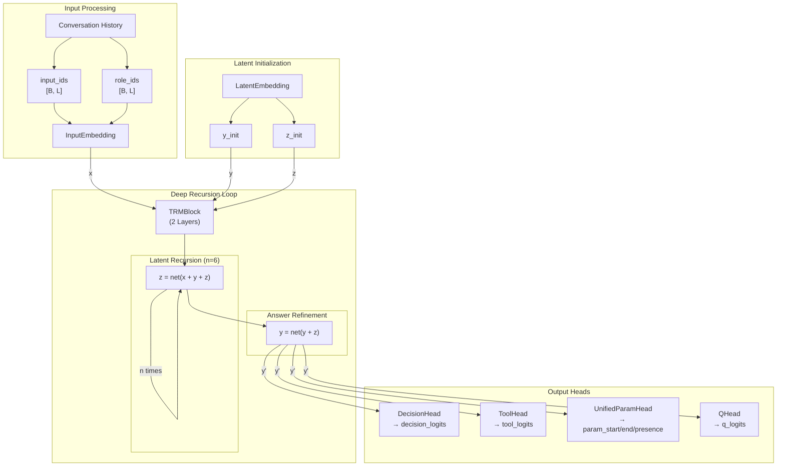

## Core Concepts

### Key Variables

| Variable | Description | Shape |
|----------|-------------|-------|
| `x` | Embedded input (history + tools) | `[B, L, D]` |
| `y` | Current answer (decision + tool/content) | `[B, L, D]` |
| `z` | Latent reasoning state | `[B, L, D]` |

Where: B = batch_size, L = seq_len, D = hidden_size

### Key Hyperparameters

| Parameter | Default | Description |
|-----------|---------|-------------|
| `n` | 6 | Latent recursion iterations |
| `T` | 3 | Deep recursion iterations |
| `N_sup` | 16 | Supervision steps (training) |
| `num_layers` | 2 | Network depth (optimal per paper) |
| `hidden_size` | 512 | Embedding dimension |

## Configuration

```python
from trm_agent.models import TRMConfig

config = TRMConfig(
    # Architecture
    hidden_size=512,
    num_layers=2,
    num_heads=8,
    intermediate_size=2048,
    dropout=0.1,
    use_attention=True,

    # Vocabulary
    vocab_size=32000,
    max_seq_len=2048,

    # TRM specific
    n_latent_recursion=6,
    T_deep_recursion=3,
    N_supervision=16,

    # Output dimensions
    num_tools=10,

    # Unified fields (slots + tool params)
    slot_fields=["address", "phone", "device_number", "name"],
)
```

## Model Components

### Component Hierarchy

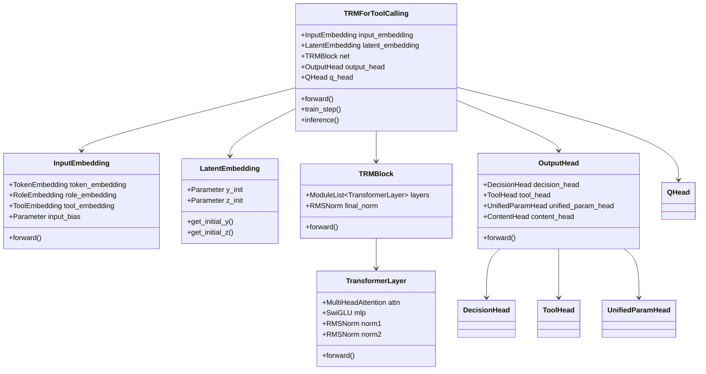

### 1. Input Embedding

Combines token, role, and learnable bias embeddings.

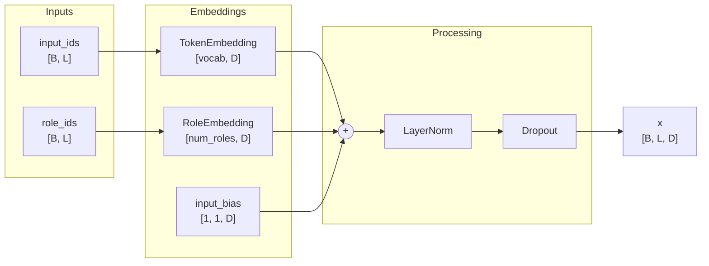

**Components:**

| Component | Description | Shape |
|-----------|-------------|-------|
| `TokenEmbedding` | Maps token IDs to vectors | `[vocab_size, hidden_size]` |
| `RoleEmbedding` | Maps role IDs to vectors | `[num_roles, hidden_size]` |
| `input_bias` | Learnable bias | `[1, 1, hidden_size]` |

### 2. Latent Embedding

Initializes `y` and `z` with learnable parameters.

```python
y_init = nn.Parameter([1, 1, hidden_size])  # Expanded to [B, L, D]
z_init = nn.Parameter([1, 1, hidden_size])  # Expanded to [B, L, D]
```

### 3. TRM Block (Core Network)

Single tiny network used for both `z` and `y` updates.

```mermaid
flowchart TB
    subgraph TRMBlock["TRMBlock"]
        Input["Input<br/>[B, L, D]"]

        subgraph Layer1["TransformerLayer 1"]
            direction TB
            N1_1["RMSNorm"]
            Attn1["MultiHeadAttention<br/>+ RoPE"]
            Add1(("+"))
            N2_1["RMSNorm"]
            MLP1["SwiGLU MLP"]
            Add2(("+"))
        end

        subgraph Layer2["TransformerLayer 2"]
            direction TB
            N1_2["RMSNorm"]
            Attn2["MultiHeadAttention<br/>+ RoPE"]
            Add3(("+"))
            N2_2["RMSNorm"]
            MLP2["SwiGLU MLP"]
            Add4(("+"))
        end

        FinalNorm["RMSNorm"]
        Output["Output<br/>[B, L, D]"]
    end

    Input --> N1_1 --> Attn1 --> Add1
    Input --> Add1
    Add1 --> N2_1 --> MLP1 --> Add2
    Add1 --> Add2

    Add2 --> N1_2 --> Attn2 --> Add3
    Add2 --> Add3
    Add3 --> N2_2 --> MLP2 --> Add4
    Add3 --> Add4

    Add4 --> FinalNorm --> Output
```

**Sub-components:**

#### RMSNorm

```python
def forward(x):
    rms = torch.rsqrt(x.pow(2).mean(-1, keepdim=True) + eps)
    return x * rms * self.weight
```

#### SwiGLU

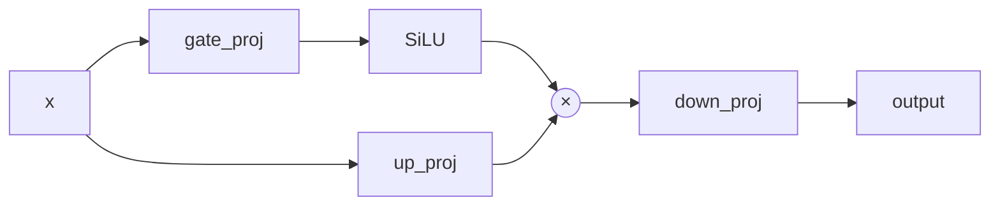

```python
def forward(x):
    gate = F.silu(self.gate_proj(x))
    up = self.up_proj(x)
    return self.down_proj(gate * up)
```

#### Multi-Head Attention with RoPE

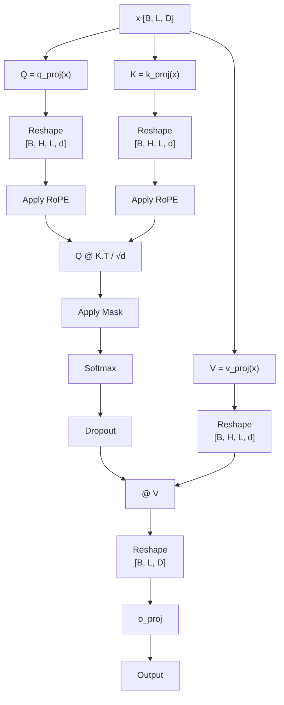

### 4. Output Heads

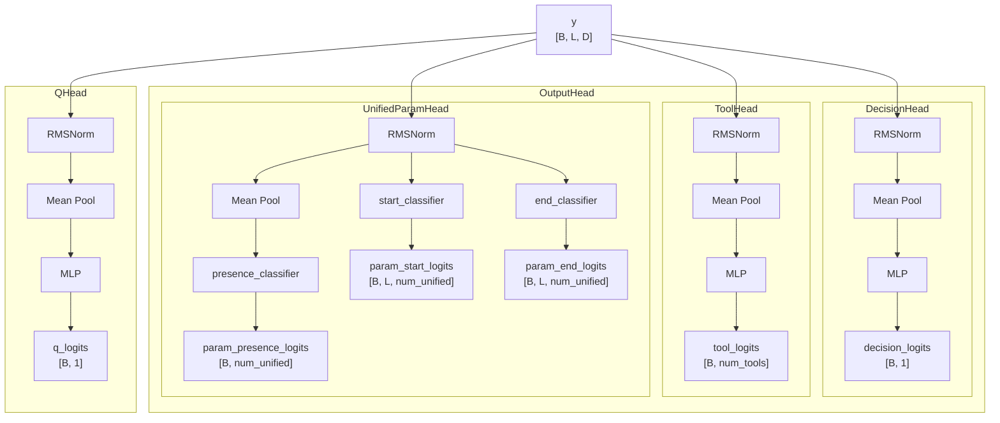

#### DecisionHead

Binary classification for tool_call vs direct_answer.

```python
y_pooled = y.mean(dim=1)  # Global average pooling
logits = MLP(y_pooled)     # [B, hidden] -> [B, 1]
```

#### ToolHead

Predicts tool name.

```python
# Tool name (classification)
tool_logits = MLP(y.mean(dim=1))  # [B, num_tools]
```

#### UnifiedParamHead

Unified extraction for both content slots and tool parameters with decision-based + tool-based masking.

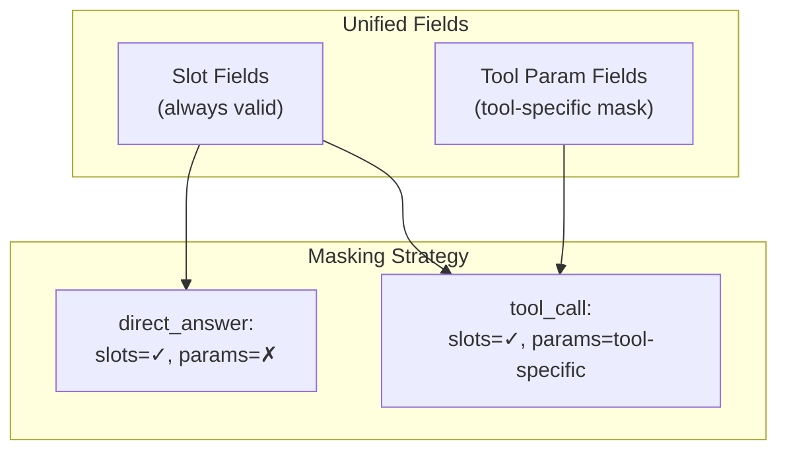

**Unified Fields:**
- `unified_fields = slot_fields + tool_param_fields` (deduplicated)
- Slots are always extracted regardless of decision
- Tool params are only valid for tool_call with tool-specific masking

```python
# Span prediction (per token)
param_start = Linear(y)  # [B, L, num_unified_fields]
param_end = Linear(y)    # [B, L, num_unified_fields]

# Presence prediction (pooled)
param_presence = MLP(y.mean(dim=1))  # [B, num_unified_fields]
```

#### QHead

Predicts halting probability for Adaptive Computational Time (ACT).

```python
q = MLP(y.mean(dim=1))  # [B, 1]
# Target: whether current prediction matches ground truth
```

## Recursion Algorithm

### Latent Recursion

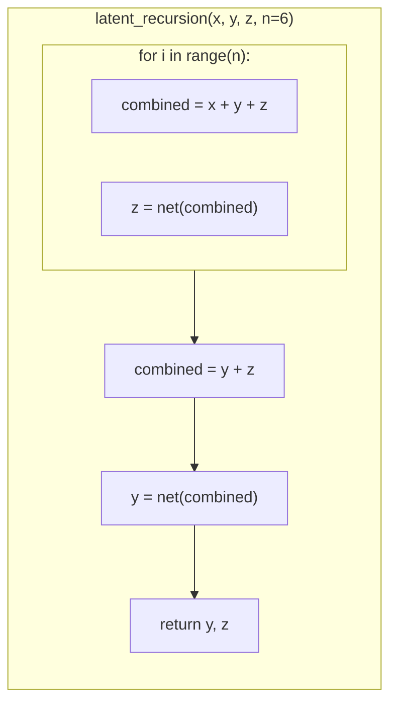

```python
def latent_recursion(x, y, z, n=6):
    """
    n iterations of latent reasoning, then refine y.
    """
    # Update z with x present (reasoning step)
    for _ in range(n):
        z = net(x + y + z)

    # Refine y without x (answer refinement step)
    y = net(y + z)

    return y, z
```

### Deep Recursion

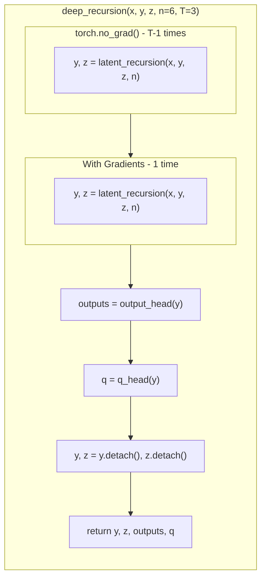

```python
def deep_recursion(x, y, z, n=6, T=3):
    """
    T-1 times without grad, 1 time with grad.
    """
    # T-1 recursions without gradients (save memory)
    with torch.no_grad():
        for _ in range(T - 1):
            y, z = latent_recursion(x, y, z, n)

    # Final recursion with gradients
    y, z = latent_recursion(x, y, z, n)

    # Get predictions
    outputs = output_head(y)
    q = q_head(y)

    return y.detach(), z.detach(), outputs, q
```

### Deep Supervision Training

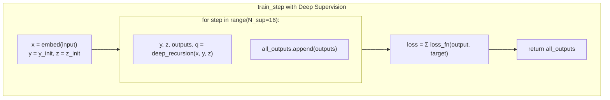

```python
def train_step(x, y, z, N_sup=16):
    """
    Training with deep supervision.
    """
    all_outputs = []

    for step in range(N_sup):
        y, z, outputs, q = deep_recursion(x, y, z)
        all_outputs.append(outputs)

    return all_outputs  # Loss computed over all steps
```

## Forward Pass Flow

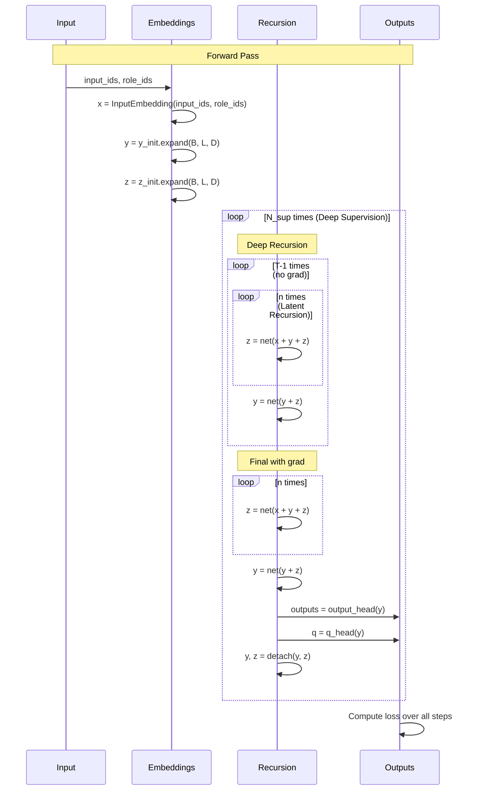

## Output Structure

```python
@dataclass
class TRMOutput:
    decision_logits: Tensor        # [B, 1] - tool_call vs direct_answer
    tool_logits: Tensor            # [B, num_tools] - tool classification
    param_start_logits: Tensor     # [B, L, num_unified] - param span start
    param_end_logits: Tensor       # [B, L, num_unified] - param span end
    param_presence_logits: Tensor  # [B, num_unified] - param presence
    q_logits: Tensor               # [B, 1] - halting probability
    y: Tensor                      # [B, L, D] - final answer embedding
    z: Tensor                      # [B, L, D] - final latent embedding
```

## Unified Parameter Extraction

The model uses a unified approach for extracting both content slots and tool parameters:

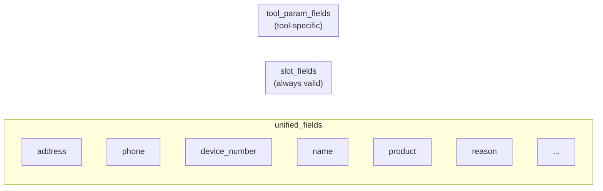

### Masking Example

| Decision | Tool | address | phone | name | product | reason |
|----------|------|---------|-------|------|---------|--------|
| direct_answer | - | ✓ | ✓ | ✓ | ✗ | ✗ |
| tool_call | tool_A | ✓ | ✓ | ✓ | ✓ | ✗ |
| tool_call | tool_B | ✓ | ✓ | ✓ | ✗ | ✓ |

## Usage Examples

### Creating Model

```python
from trm_agent.models import TRMConfig, TRMForToolCalling

config = TRMConfig(
    hidden_size=512,
    num_layers=2,
    num_tools=15,
    slot_fields=["address", "phone", "device_number", "name"],
)

# Set tool param fields (auto-collected from dataset)
config.set_tool_param_fields(["product", "reason", "quantity"])

model = TRMForToolCalling(config)
print(f"Parameters: {sum(p.numel() for p in model.parameters()):,}")
```

### Training Forward Pass

```python
# Training with deep supervision
outputs = model.train_step(
    input_ids=batch["input_ids"],
    attention_mask=batch["attention_mask"],
    role_ids=batch["role_ids"],
)
# Returns list of N_sup TRMOutput objects
```

### Inference

```python
# Inference (full N_sup steps)
with torch.no_grad():
    output = model.inference(
        input_ids=batch["input_ids"],
        attention_mask=batch["attention_mask"],
        role_ids=batch["role_ids"],
    )

# Get predictions
decision = torch.sigmoid(output.decision_logits) > 0.5
tool_id = output.tool_logits.argmax(dim=-1)
param_presence = torch.sigmoid(output.param_presence_logits) > 0.5
```

## Why This Architecture Works

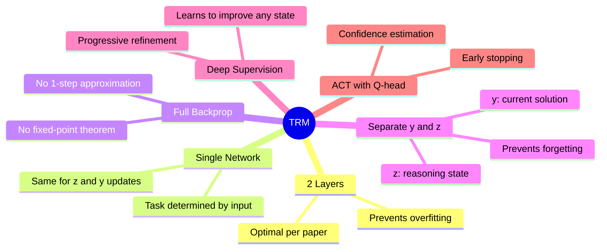

1. **2 layers is optimal**: More layers overfit on small datasets
2. **Single network**: Same network for reasoning (z) and refinement (y)
3. **Full backprop**: No 1-step gradient approximation needed
4. **Separate y and z**:
   - `y` stores current solution
   - `z` stores reasoning state (prevents forgetting)
5. **Deep supervision**: Model learns to improve any (y, z) state
6. **ACT with Q-head**: Enables early stopping when confident

## Model Size

With default configuration:

| Component | Parameters |
|-----------|------------|
| Token Embedding | 16.4M |
| Role Embedding | 2K |
| TRM Block (2 layers) | 6.3M |
| Output Heads | 1.2M |
| **Total** | **~24M** |

For smaller model (paper's 7M):
- Reduce hidden_size to 256
- Reduce vocab_size
