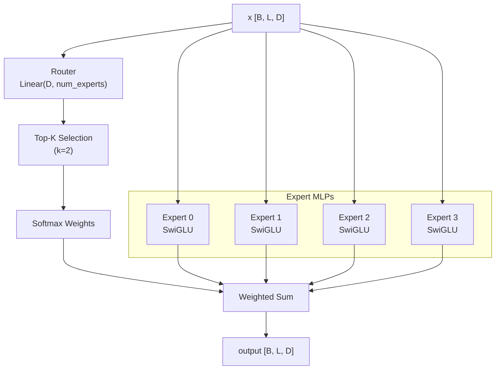

# Model Architecture

This document describes the TRM (Tiny Recursive Model) architecture for tool-calling, based on the paper "Less is More: Recursive Reasoning with Tiny Networks".

> **Note:** Span extraction (slots/params) is handled by **GLiNER2**, not TRM. TRM only handles decision classification (tool_call vs direct_answer) and tool selection.

## Overview

TRM is a recursive reasoning model that uses a **single tiny network** (2 layers, ~7M parameters) to iteratively refine answers through recursive computation.


## Core Concepts

### Key Variables

| Variable | Description | Shape |
|----------|-------------|-------|
| `x` | Embedded input (history + tools) | `[B, L, D]` |
| `y` | Current answer (decision + tool/content) | `[B, L, D]` |
| `z` | Latent reasoning state | `[B, L, D]` |

Where: B = batch_size, L = seq_len, D = hidden_size

### Key Hyperparameters

| Parameter | Default | Description |
|-----------|---------|-------------|
| `n` | 6 | Latent recursion iterations |
| `T` | 3 | Deep recursion iterations |
| `N_sup` | 16 | Supervision steps (training) |
| `num_layers` | 2 | Network depth (optimal per paper) |
| `hidden_size` | 512 | Embedding dimension |

## Configuration

```python
from trm_agent.models import TRMConfig

config = TRMConfig(
    # Architecture
    hidden_size=512,
    num_layers=2,
    num_heads=8,
    intermediate_size=2048,
    dropout=0.1,
    use_attention=True,

    # Vocabulary
    vocab_size=32000,
    max_seq_len=2048,

    # TRM specific
    n_latent_recursion=6,
    T_deep_recursion=3,
    N_supervision=16,

    # URM innovations (enabled by default)
    use_conv_swiglu=True,
    conv_kernel_size=2,
    tbptl_no_grad_steps=2,

    # Output dimensions
    num_tools=10,
)
```

## Model Components

### Component Hierarchy


### 1. Input Embedding

Combines token, role, and learnable bias embeddings.


**Components:**

| Component | Description | Shape |
|-----------|-------------|-------|
| `TokenEmbedding` | Maps token IDs to vectors | `[vocab_size, hidden_size]` |
| `RoleEmbedding` | Maps role IDs to vectors | `[num_roles, hidden_size]` |
| `input_bias` | Learnable bias | `[1, 1, hidden_size]` |

### 2. Latent Embedding

Initializes `y` and `z` with learnable parameters.

```python
y_init = nn.Parameter([1, 1, hidden_size])  # Expanded to [B, L, D]
z_init = nn.Parameter([1, 1, hidden_size])  # Expanded to [B, L, D]
```

### 3. TRM Block (Core Network)

Single tiny network used for both `z` and `y` updates.


**Sub-components:**

#### RMSNorm

```python
def forward(x):
    rms = torch.rsqrt(x.pow(2).mean(-1, keepdim=True) + eps)
    return x * rms * self.weight
```

#### SwiGLU


```python
def forward(x):
    gate = F.silu(self.gate_proj(x))
    up = self.up_proj(x)
    return self.down_proj(gate * up)
```

#### Multi-Head Attention with RoPE


### 4. Output Heads

> **Note:** Span extraction (UnifiedParamHead) has been removed. GLiNER2 now handles entity extraction.


#### DecisionHead

Binary classification for tool_call vs direct_answer.

```python
y_pooled = y.mean(dim=1)  # Global average pooling
logits = MLP(y_pooled)     # [B, hidden] -> [B, 1]
```

#### ToolHead

Predicts tool name.

```python
# Tool name (classification)
tool_logits = MLP(y.mean(dim=1))  # [B, num_tools]
```

#### QHead

Predicts halting probability for Adaptive Computational Time (ACT).

```python
q = MLP(y.mean(dim=1))  # [B, 1]
# Target: whether current prediction matches ground truth
```

## Recursion Algorithm

### Latent Recursion


```python
def latent_recursion(x, y, z, n=6):
    """
    n iterations of latent reasoning, then refine y.
    """
    # Update z with x present (reasoning step)
    for _ in range(n):
        z = net(x + y + z)

    # Refine y without x (answer refinement step)
    y = net(y + z)

    return y, z
```

### Deep Recursion


```python
def deep_recursion(x, y, z, n=6, T=3):
    """
    T-1 times without grad, 1 time with grad.
    """
    # T-1 recursions without gradients (save memory)
    with torch.no_grad():
        for _ in range(T - 1):
            y, z = latent_recursion(x, y, z, n)

    # Final recursion with gradients
    y, z = latent_recursion(x, y, z, n)

    # Get predictions
    outputs = output_head(y)
    q = q_head(y)

    return y.detach(), z.detach(), outputs, q
```

### Deep Supervision Training


```python
def train_step(x, y, z, N_sup=16):
    """
    Training with deep supervision.
    """
    all_outputs = []

    for step in range(N_sup):
        y, z, outputs, q = deep_recursion(x, y, z)
        all_outputs.append(outputs)

    return all_outputs  # Loss computed over all steps
```

## Forward Pass Flow


## Output Structure

```python
@dataclass
class TRMOutput:
    decision_logits: Tensor        # [B, 1] - tool_call vs direct_answer
    tool_logits: Tensor            # [B, num_tools] - tool classification
    q_logits: Tensor               # [B, 1] - halting probability
    y: Tensor                      # [B, L, D] - final answer embedding
    z: Tensor                      # [B, L, D] - final latent embedding
```

> **Note:** Span extraction (param_start/end/presence_logits) has been removed. Use GLiNER2 for entity extraction.

## Entity Extraction with GLiNER2

> **Note:** Entity extraction (slots and tool parameters) is now handled by **GLiNER2**, not TRM.

GLiNER2 provides:
- Named Entity Recognition (NER) for extracting slots and parameters
- LoRA fine-tuning for domain adaptation
- Better generalization to unseen entity types

See the GLiNER2 documentation for details on entity extraction.

## Usage Examples

### Creating Model

```python
from trm_agent.models import TRMConfig, TRMForToolCalling

config = TRMConfig(
    hidden_size=512,
    num_layers=2,
    num_tools=15,
    # URM innovations (enabled by default)
    use_conv_swiglu=True,
    conv_kernel_size=2,
    tbptl_no_grad_steps=2,
)

model = TRMForToolCalling(config)
print(f"Parameters: {sum(p.numel() for p in model.parameters()):,}")
```

### Training Forward Pass

```python
# Training with deep supervision
outputs = model.train_step(
    input_ids=batch["input_ids"],
    attention_mask=batch["attention_mask"],
    role_ids=batch["role_ids"],
)
# Returns list of N_sup TRMOutput objects
```

### Inference

```python
# Inference (full N_sup steps)
with torch.no_grad():
    output = model.inference(
        input_ids=batch["input_ids"],
        attention_mask=batch["attention_mask"],
        role_ids=batch["role_ids"],
    )

# Get predictions
decision = torch.sigmoid(output.decision_logits) > 0.5  # tool_call or direct_answer
tool_id = output.tool_logits.argmax(dim=-1)             # which tool

# For entity extraction, use GLiNER2 separately
```

## Why This Architecture Works


1. **2 layers is optimal**: More layers overfit on small datasets
2. **Single network**: Same network for reasoning (z) and refinement (y)
3. **Full backprop**: No 1-step gradient approximation needed
4. **Separate y and z**:
   - `y` stores current solution
   - `z` stores reasoning state (prevents forgetting)
5. **Deep supervision**: Model learns to improve any (y, z) state
6. **ACT with Q-head**: Enables early stopping when confident

## Model Size

With default configuration:

| Component | Parameters |
|-----------|------------|
| Token Embedding | 16.4M |
| Role Embedding | 2K |
| TRM Block (2 layers) | 6.3M |
| Output Heads | 1.2M |
| **Total** | **~24M** |

For smaller model (paper's 7M):
- Reduce hidden_size to 256
- Reduce vocab_size

## URM Innovations

Based on the Universal Reasoning Model (URM) paper, we integrated two key innovations:

### ConvSwiGLU

Replaces standard SwiGLU with a version that includes depthwise short convolution for local feature mixing.


**Benefits:**
- +5-8% accuracy improvement on reasoning tasks
- Enhances local token interactions
- Minimal parameter overhead

**Configuration:**
```python
config = TRMConfig(
    use_conv_swiglu=True,   # Enable ConvSwiGLU (default: True)
    conv_kernel_size=2,      # Short conv kernel size (default: 2)
)
```

### TBPTL (Truncated Backprop Through Loops)

Skips loss computation on the first K supervision steps during training.


**Benefits:**
- ~12% memory reduction
- ~5% training speedup
- +2-3% accuracy improvement

**Configuration:**
```python
config = TRMConfig(
    tbptl_no_grad_steps=2,  # Skip loss on first 2 steps (default: 2)
)
```

### Combined Impact

| Feature | Memory | Speed | Accuracy Gain |
|---------|--------|-------|---------------|
| ConvSwiGLU | ~same | -2% | +5-8% |
| TBPTL (2 steps) | -12% | +5% | +2-3% |
| **Combined** | -12% | +3% | **+7-10%** |

### Disabling URM Innovations

To use the original TRM architecture without URM innovations:

```python
config = TRMConfig(
    use_conv_swiglu=False,     # Use standard SwiGLU
    tbptl_no_grad_steps=0,     # No TBPTL (compute loss on all steps)
)
```

## TRM Recursive Loop Option

By default, TRM uses its characteristic recursive reasoning loop with latent recursion and deep supervision. However, when using hybrid architecture with Mamba, you can optionally disable the TRM loop and let Mamba's state space handle recurrence internally.

### Configuration

| Parameter | Default | Description |
|-----------|---------|-------------|
| `use_trm_loop` | `True` | Enable TRM recursive reasoning loop |

### Forward Pass Modes

#### With TRM Loop (default)


**Characteristics:**
- Full TRM recursive reasoning algorithm
- Latent recursion (n=6 iterations)
- Deep recursion (T=3 iterations)
- Deep supervision (N_sup=16 steps)
- More computationally expensive
- Better for complex reasoning tasks

#### Without TRM Loop (single-pass mode)


**Characteristics:**
- Single forward pass through the network
- Mamba's state space handles sequential dependencies internally
- Faster training and inference
- Lower memory usage
- Better suited when using hybrid Mamba architecture

### Usage

#### Python Configuration

```python
from trm_agent.models import TRMConfig, TRMForToolCalling

# With TRM loop (default)
config_with_loop = TRMConfig(
    use_trm_loop=True,  # Default
    n_latent_recursion=6,
    T_deep_recursion=3,
    N_supervision=16,
)

# Without TRM loop (single-pass, Mamba handles recurrence)
config_single_pass = TRMConfig(
    use_trm_loop=False,
    use_hybrid_block=True,  # Typically used with Mamba
)
```

#### CLI Flag

```bash
# Default: TRM loop enabled
uv run python tools/train.py \
    --config configs/default.yaml \
    --train-data data/train.jsonl

# Disable TRM loop (single-pass mode)
uv run python tools/train.py \
    --config configs/default.yaml \
    --train-data data/train.jsonl \
    --no-trm-loop \
    --use-hybrid
```

### When to Use Each Mode

| Scenario | Recommendation |
|----------|----------------|
| Standard TRM training | `use_trm_loop=True` (default) |
| Hybrid Mamba + fast training | `use_trm_loop=False` |
| Complex multi-step reasoning | `use_trm_loop=True` |
| Simple tool classification | `use_trm_loop=False` |
| Memory constrained | `use_trm_loop=False` |
| Maximum accuracy | `use_trm_loop=True` |

### Implementation Details

When `use_trm_loop=False`:
- `_forward_single_pass()` is used instead of `_forward_with_trm_loop()`
- Input is embedded and passed through TRMBlock once
- Output heads receive the hidden state directly
- `y` and `z` outputs are both set to the hidden state (no separate latent)
- Training returns single output (wrapped in list for compatibility)

## Hybrid Architecture (Mamba + MoE + Attention)

The hybrid architecture replaces standard TransformerLayers with HybridBlocks that combine three complementary processing mechanisms.

### Overview

```
              HybridBlock (per layer)
┌─────────────────────────────────────────────────┐
│  Input                                          │
│    │                                            │
│    ▼                                            │
│  RMSNorm → Mamba → + Residual                   │  O(n) sequential
│    │                                            │
│    ▼                                            │
│  RMSNorm → MoE (4 experts, top-2) → + Residual  │  Sparse capacity
│    │                                            │
│    ▼                                            │
│  RMSNorm → MultiHead Attention → + Residual     │  O(n²) global
│    │                                            │
│    ▼                                            │
│  Output                                         │
└─────────────────────────────────────────────────┘
```

### Components

#### 1. MambaLayer

Selective State Space Model for efficient sequential processing. Supports both Mamba1 and Mamba2.

| Parameter | Default | Description |
|-----------|---------|-------------|
| `mamba_version` | 2 | Mamba version: 1 or 2 |
| `mamba_d_state` | 16 | SSM state dimension (Mamba1 only) |
| `mamba_d_conv` | 4 | Local convolution width |
| `mamba_expand` | 2 | Block expansion factor |
| `mamba_headdim` | 64 | Head dimension (Mamba2 only) |

**Mamba1 vs Mamba2:**

| Feature | Mamba1 | Mamba2 |
|---------|--------|--------|
| Algorithm | Selective SSM | SSD (State Space Duality) |
| Key param | `d_state` | `headdim` |
| Performance | Good | Better (+10-20% speed) |
| Memory | Higher | Lower |

**Benefits:**
- O(n) complexity vs O(n²) for attention
- Efficient long-range dependency modeling
- Hardware-efficient implementation
- Mamba2 offers improved speed and memory efficiency

**Requirements for CUDA Kernels:**

| Package | Version | Notes |
|---------|---------|-------|
| Python | 3.10 | Recommended |
| PyTorch | 2.1.1+ | Must match CUDA version |
| CUDA | 11.8+ | 11.8 or 12.x |
| mamba-ssm | 2.0.3+ | With causal-conv1d |
| causal-conv1d | 1.5.0+ | Required for fast kernels |
| numpy | <2.0 | Avoid numpy 2.x |

**Installation:**
```bash
# Install with CUDA kernels
pip install causal-conv1d>=1.5.0
pip install mamba-ssm>=2.0.3

# Or via project extras
uv add "trm-agent[mamba]"
```

**Troubleshooting:**
- If training hangs, use `--no-mamba-cuda-kernels` to disable CUDA kernels
- If still failing, use `--mamba-version 1` to use Mamba1 instead
- Ensure `chunk_size` is power of 2 (default: 256)

#### 2. MoELayer (Mixture of Experts)

Sparse expert routing for capacity scaling without proportional compute increase.

| Parameter | Default | Description |
|-----------|---------|-------------|
| `num_experts` | 4 | Number of expert MLPs |
| `num_experts_per_tok` | 2 | Top-k experts per token |
| `moe_intermediate_size` | 1024 | Expert MLP hidden size |



#### 3. MultiHeadAttention

Standard attention for global context aggregation (same as TransformerLayer).

### Configuration

```python
from trm_agent.models import TRMConfig

# Using Mamba2 (default, recommended)
config = TRMConfig(
    # Enable hybrid architecture
    use_hybrid_block=True,

    # Mamba2 configuration (default)
    mamba_version=2,
    mamba_headdim=64,
    mamba_d_conv=4,
    mamba_expand=2,

    # MoE configuration
    num_experts=4,
    num_experts_per_tok=2,
    moe_intermediate_size=1024,
)

# Using Mamba1 (legacy)
config_mamba1 = TRMConfig(
    use_hybrid_block=True,
    mamba_version=1,
    mamba_d_state=16,
    mamba_d_conv=4,
    mamba_expand=2,
)
```

### CLI Usage

```bash
# Install mamba support
uv add "trm-agent[mamba]"

# Train with hybrid architecture (Mamba2 by default)
uv run python tools/train.py \
    --config configs/default.yaml \
    --train-data data/train.jsonl \
    --use-hybrid \
    --num-experts 4 \
    --experts-per-token 2 \
    --output-dir outputs/

# Use Mamba1 instead
uv run python tools/train.py \
    --config configs/default.yaml \
    --train-data data/train.jsonl \
    --use-hybrid \
    --mamba-version 1 \
    --output-dir outputs/
```

### Architecture Comparison

| Component | Standard TRMBlock | Hybrid TRMBlock |
|-----------|-------------------|-----------------|
| Layer type | TransformerLayer | HybridBlock |
| Sequential | Attention + MLP | Mamba |
| Sparse | - | MoE (4 experts) |
| Global | Attention | Attention |
| Complexity | O(n²) | O(n) + O(n) + O(n²) |

### TRM Compatibility

The hybrid architecture **fully preserves TRM's recursive reasoning algorithm**:

1. **Latent recursion** (`z = net(x + y + z)`) unchanged
2. **Answer refinement** (`y = net(y + z)`) unchanged
3. **Deep recursion** (T iterations) unchanged
4. **Deep supervision** (N_sup steps) unchanged

Only the internal "net" implementation changes from TransformerLayer to HybridBlock. The recursive reasoning pattern remains identical.

```
TRM Algorithm (unchanged):
┌─────────────────────────────────────────┐
│  for step in range(N_sup):              │
│      for t in range(T):                 │
│          for i in range(n):             │
│              z = net(x + y + z)  ←──────│── HybridBlock or TransformerLayer
│          y = net(y + z)          ←──────│── HybridBlock or TransformerLayer
│      outputs = output_head(y)           │
│      q = q_head(y)                      │
└─────────────────────────────────────────┘
```

### When to Use Hybrid

| Scenario | Recommendation |
|----------|----------------|
| Short sequences (<512 tokens) | Standard Transformer |
| Long sequences (>1024 tokens) | Hybrid (Mamba benefits) |
| Memory constrained | Hybrid (sparse MoE) |
| Maximum accuracy | Hybrid + more experts |
| Fastest training | Standard Transformer |

### Fallback Behavior

If `mamba-ssm` is not installed but `use_hybrid_block=True`:
- Model initialization raises `ImportError`
- For Mamba2: "Mamba2 is required but not available. Install with: pip install 'mamba-ssm[causal-conv1d]>=2.0'"
- For Mamba1: "mamba-ssm is required for MambaLayer"

To check availability:
```python
from trm_agent.models.layers import MAMBA_AVAILABLE, MAMBA2_AVAILABLE

print(f"Mamba1 available: {MAMBA_AVAILABLE}")
print(f"Mamba2 available: {MAMBA2_AVAILABLE}")
```
