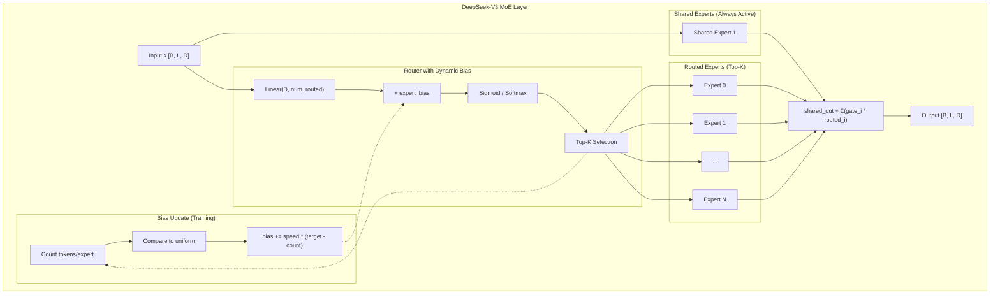

# DeepSeek-V3 Style MoE Implementation Plan

## Overview

Implement DeepSeek-V3's MoE improvements to enhance the current MoE layer with:
1. Auxiliary-Loss-Free Load Balancing (dynamic bias)
2. Shared + Routed Expert Architecture
3. Sigmoid Gating (instead of softmax)
4. Fine-Grained Expert Segmentation
5. Optional Sequence-Wise Auxiliary Loss

## Current vs Target Architecture

```
Current MoE:                          DeepSeek-V3 Style MoE (New Default):
┌─────────────────┐                   ┌─────────────────────────────────┐
│  4 Experts      │                   │  1 Shared + N Routed Experts    │
│  Top-2 Routing  │                   │  Top-K Routing with Bias        │
│  Softmax Gates  │         →         │  Sigmoid Gates                  │
│  No Aux Loss    │                   │  Auxiliary-Loss-Free Balancing  │
│  No Shared      │                   │  Optional Seq-Wise Aux Loss     │
└─────────────────┘                   └─────────────────────────────────┘
```

> **Note:** The new MoE layer completely replaces the old `MoELayer`. No version toggle needed.

## Implementation Phases

### Phase 1: Core MoE Layer Refactor

**File:** `trm_agent/models/layers.py`

#### 1.1 Add DeepSeekV3MoELayer Class

```python
class DeepSeekV3MoELayer(nn.Module):
    """DeepSeek-V3 style MoE with auxiliary-loss-free load balancing.

    Key innovations:
    - Shared experts (always active) + Routed experts (top-k)
    - Sigmoid gating instead of softmax
    - Dynamic bias for load balancing (no auxiliary loss)
    - Fine-grained expert segmentation
    """

    def __init__(self, config: TRMConfig):
        super().__init__()
        # Shared experts
        self.num_shared_experts = config.moe_num_shared_experts  # Default: 1
        self.shared_experts = nn.ModuleList([
            Expert(config.hidden_size, config.moe_intermediate_size)
            for _ in range(self.num_shared_experts)
        ])

        # Routed experts
        self.num_routed_experts = config.moe_num_routed_experts  # Default: 8
        self.routed_experts = nn.ModuleList([
            Expert(config.hidden_size, config.moe_intermediate_size)
            for _ in range(self.num_routed_experts)
        ])

        # Router
        self.router = nn.Linear(config.hidden_size, self.num_routed_experts, bias=False)

        # Dynamic bias (not trained by gradient)
        self.register_buffer(
            'expert_bias',
            torch.zeros(self.num_routed_experts)
        )

        # Config
        self.top_k = config.moe_top_k  # Default: 2
        self.bias_update_speed = config.moe_bias_update_speed  # Default: 0.001
        self.use_sigmoid_gating = config.moe_use_sigmoid_gating  # Default: True
        self.seq_aux_loss_weight = config.moe_seq_aux_loss_weight  # Default: 0.0
```

#### 1.2 Implement Forward Pass

```python
def forward(self, x: torch.Tensor) -> tuple[torch.Tensor, torch.Tensor]:
    """
    Returns:
        output: [B, L, D] - MoE output
        aux_loss: scalar - auxiliary loss (0 if disabled)
    """
    batch_size, seq_len, hidden_size = x.shape
    x_flat = x.view(-1, hidden_size)

    # 1. Shared experts (process ALL tokens)
    shared_output = torch.zeros_like(x_flat)
    for expert in self.shared_experts:
        shared_output = shared_output + expert(x_flat)

    # 2. Router scores with dynamic bias
    router_logits = self.router(x_flat)  # [B*L, num_routed]
    scores_with_bias = router_logits + self.expert_bias

    # 3. Gating (sigmoid vs softmax)
    if self.use_sigmoid_gating:
        gates = torch.sigmoid(scores_with_bias)
    else:
        gates = F.softmax(scores_with_bias, dim=-1)

    # 4. Top-k selection
    topk_gates, topk_indices = torch.topk(gates, self.top_k, dim=-1)

    # 5. Normalize gates
    topk_gates = topk_gates / (topk_gates.sum(dim=-1, keepdim=True) + 1e-9)

    # 6. Compute routed expert outputs
    routed_output = self._compute_routed_output(x_flat, topk_gates, topk_indices)

    # 7. Update bias (training only)
    if self.training:
        self._update_expert_bias(topk_indices)

    # 8. Combine outputs
    output = shared_output + routed_output

    # 9. Optional sequence-wise auxiliary loss
    aux_loss = torch.tensor(0.0, device=x.device)
    if self.seq_aux_loss_weight > 0 and self.training:
        aux_loss = self._compute_seq_aux_loss(router_logits, topk_indices, seq_len)

    return output.view(batch_size, seq_len, hidden_size), aux_loss
```

#### 1.3 Implement Bias Update

```python
@torch.no_grad()
def _update_expert_bias(self, selected_experts: torch.Tensor):
    """Update bias to balance expert load without auxiliary loss."""
    # Count tokens per expert
    expert_counts = torch.zeros(
        self.num_routed_experts,
        device=selected_experts.device
    )
    for i in range(self.num_routed_experts):
        expert_counts[i] = (selected_experts == i).sum()

    # Target: uniform distribution
    total_selections = selected_experts.numel()
    target_count = total_selections / self.num_routed_experts

    # Update: overloaded → decrease bias, underutilized → increase bias
    bias_update = self.bias_update_speed * (target_count - expert_counts)
    self.expert_bias.add_(bias_update)
```

#### 1.4 Implement Sequence-Wise Auxiliary Loss

```python
def _compute_seq_aux_loss(
    self,
    router_logits: torch.Tensor,
    selected_experts: torch.Tensor,
    seq_len: int
) -> torch.Tensor:
    """Compute per-sequence auxiliary loss for extreme imbalance prevention."""
    batch_size = router_logits.shape[0] // seq_len
    router_logits = router_logits.view(batch_size, seq_len, -1)
    selected_experts = selected_experts.view(batch_size, seq_len, -1)

    total_loss = 0.0
    for b in range(batch_size):
        seq_logits = router_logits[b]  # [L, num_experts]
        seq_selected = selected_experts[b]  # [L, top_k]

        # Probability distribution
        probs = F.softmax(seq_logits, dim=-1).mean(dim=0)  # [num_experts]

        # Frequency of selection
        freq = torch.zeros(self.num_routed_experts, device=seq_logits.device)
        for i in range(self.num_routed_experts):
            freq[i] = (seq_selected == i).float().mean()

        # Loss: encourage uniform distribution
        total_loss = total_loss + (probs * freq).sum() * self.num_routed_experts

    return total_loss / batch_size * self.seq_aux_loss_weight
```

### Phase 2: Config Updates

**File:** `trm_agent/models/config.py`

Add new configuration parameters (replaces old `num_experts`, `num_experts_per_tok`):

```python
@dataclass
class TRMConfig:
    # ... existing params ...

    # DeepSeek-V3 MoE configuration (replaces old MoE params)
    moe_num_shared_experts: int = 1  # Shared experts (always active)
    moe_num_routed_experts: int = 8  # Routed experts (top-k selection)
    moe_top_k: int = 2  # Top-k experts per token
    moe_intermediate_size: int = 1024  # Expert FFN hidden size (existing)
    moe_use_sigmoid_gating: bool = True  # Sigmoid vs softmax
    moe_bias_update_speed: float = 0.001  # Bias update rate
    moe_seq_aux_loss_weight: float = 0.0  # 0 = disabled, 0.0001 = small
```

**Migration:** Remove old params `num_experts`, `num_experts_per_tok` and rename to `moe_*` prefix for clarity.

### Phase 3: Integration with HybridBlock

**File:** `trm_agent/models/layers.py`

Update HybridBlock to use the new MoE (replaces old `MoELayer`):

```python
class HybridBlock(nn.Module):
    def __init__(self, config: TRMConfig):
        super().__init__()

        # Mamba layer
        self.mamba_norm = RMSNorm(config.hidden_size)
        self.mamba = MambaLayer(config)

        # MoE layer (DeepSeek-V3 style)
        self.moe_norm = RMSNorm(config.hidden_size)
        self.moe = MoELayer(config)  # New MoELayer replaces old one

        # Attention layer
        self.attn_norm = RMSNorm(config.hidden_size)
        self.attn = MultiHeadAttention(config)

        self.dropout = nn.Dropout(config.dropout)

    def forward(
        self,
        x: torch.Tensor,
        attention_mask: Optional[torch.Tensor] = None
    ) -> tuple[torch.Tensor, torch.Tensor]:
        """Returns (output, aux_loss)."""
        # Mamba
        residual = x
        x = self.mamba_norm(x)
        x = self.mamba(x)
        x = self.dropout(x) + residual

        # MoE (returns aux_loss for load balancing)
        residual = x
        x = self.moe_norm(x)
        x, aux_loss = self.moe(x)
        x = self.dropout(x) + residual

        # Attention
        residual = x
        x = self.attn_norm(x)
        x = self.attn(x, attention_mask)
        x = self.dropout(x) + residual

        return x, aux_loss
```

**Note:** The new `MoELayer` class completely replaces the old one. No conditional logic needed.

### Phase 4: Update TRMBlock

**File:** `trm_agent/models/layers.py`

```python
class TRMBlock(nn.Module):
    def forward(
        self,
        x: torch.Tensor,
        attention_mask: Optional[torch.Tensor] = None,
    ) -> tuple[torch.Tensor, torch.Tensor]:
        """Returns (output, total_aux_loss)."""
        total_aux_loss = torch.tensor(0.0, device=x.device)

        for layer in self.layers:
            if isinstance(layer, HybridBlock):
                x, aux_loss = layer(x, attention_mask)
                total_aux_loss = total_aux_loss + aux_loss
            else:
                x = layer(x, attention_mask)

        return self.final_norm(x), total_aux_loss
```

### Phase 5: Update Training Loop

**Files:**
- `trm_agent/models/trm.py`
- `trm_agent/models/sudoku.py`
- `tools/train_sudoku.py`

Add auxiliary loss to total loss:

```python
def compute_loss(outputs, targets, aux_losses, config):
    """Compute total loss including MoE auxiliary loss."""
    main_loss = compute_main_loss(outputs, targets)

    # Sum auxiliary losses from all steps
    total_aux_loss = sum(aux_losses)

    return main_loss + total_aux_loss
```

### Phase 6: CLI Arguments

**File:** `tools/train_sudoku.py` (and other training scripts)

```python
parser.add_argument("--moe-shared-experts", type=int, default=1,
                    help="Number of shared experts (always active)")
parser.add_argument("--moe-routed-experts", type=int, default=8,
                    help="Number of routed experts (top-k selection)")
parser.add_argument("--moe-top-k", type=int, default=2,
                    help="Top-k experts per token")
parser.add_argument("--no-moe-sigmoid-gating", action="store_true",
                    help="Use softmax instead of sigmoid gating")
parser.add_argument("--moe-bias-update-speed", type=float, default=0.001,
                    help="Bias update speed for load balancing")
parser.add_argument("--moe-seq-aux-loss", type=float, default=0.0,
                    help="Sequence-wise auxiliary loss weight (0 = disabled)")
```

## File Changes Summary

| File | Changes |
|------|---------|
| `trm_agent/models/config.py` | Replace old MoE params with `moe_*` prefixed params |
| `trm_agent/models/layers.py` | Replace `MoELayer` with DeepSeek-V3 style, update `HybridBlock`, `TRMBlock` |
| `trm_agent/models/trm.py` | Handle aux_loss in forward pass |
| `trm_agent/models/sudoku.py` | Handle aux_loss in forward pass |
| `tools/train_sudoku.py` | Add CLI args, include aux_loss in training |
| `docs/03_model_architecture.md` | Document new MoE architecture |

## Architecture Diagram



## Testing Plan

1. **Unit Tests:**
   - Test bias update mechanism
   - Test shared + routed expert combination
   - Test sigmoid vs softmax gating
   - Test auxiliary loss computation
   - Test expert output aggregation

2. **Integration Tests:**
   - Test with HybridBlock
   - Test with TRMBlock
   - Test backward pass (gradients flow correctly)
   - Test aux_loss propagation through layers

3. **Training Tests:**
   - Monitor expert utilization distribution
   - Verify load balancing without aux loss (bias adjustment works)
   - Compare training stability with old MoE
   - Check memory usage (shared experts overhead)

## Default Configuration

```yaml
# configs/sudoku.yaml (with DeepSeek-V3 MoE)
model:
  use_hybrid_block: true

  # DeepSeek-V3 MoE (shared + routed experts)
  moe_num_shared_experts: 1       # Always active
  moe_num_routed_experts: 8       # Top-k selection
  moe_top_k: 2                    # Select top-2 from routed
  moe_intermediate_size: 512     # Expert FFN size
  moe_use_sigmoid_gating: true    # Sigmoid (not softmax)
  moe_bias_update_speed: 0.001    # Load balancing bias update
  moe_seq_aux_loss_weight: 0.0    # Disabled (aux-loss-free)
```

## Implementation Order

1. [x] Update config parameters in `TRMConfig` (replace old `num_experts` with `moe_*`)
2. [x] Replace `MoELayer` with DeepSeek-V3 style implementation
3. [x] Update `HybridBlock` to handle aux_loss
4. [x] Update `TRMBlock` to aggregate and return aux_loss
5. [x] Update `TRMForToolCalling` forward pass to handle aux_loss
6. [x] Update `TRMForSudoku` forward pass to handle aux_loss
7. [x] Add CLI arguments to training scripts
8. [x] Include aux_loss in training loop
9. [x] Update documentation
10. [ ] Add unit tests
11. [ ] Run training to verify load balancing

## References

- [DeepSeek-V3 Technical Report](https://arxiv.org/abs/2401.06066)
- [DeepSeek-MoE Paper](https://arxiv.org/abs/2401.06066)
- [Switch Transformer](https://arxiv.org/abs/2101.03961)
- [Mixtral of Experts](https://arxiv.org/abs/2401.04088)
